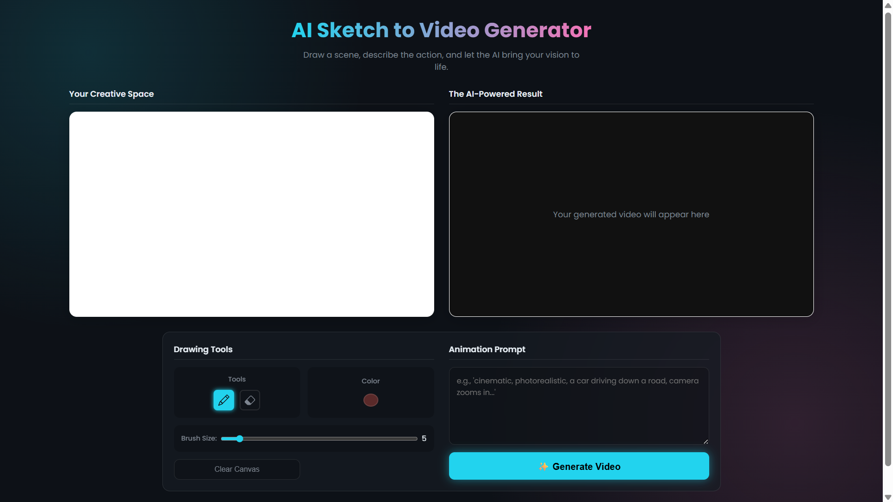

# AI Sketch to Video Generator

This web application empowers users to bring their imagination to life by transforming a simple sketch and a text prompt into a full-fledged animated video. It leverages the power of Google's latest generative AI models, using **Gemini** to convert a drawing into a photorealistic image and **Veo** (via Vertex AI) to animate that image into a cinematic video clip.



## ✨ Features

- **Interactive Drawing Canvas:** A feature-rich canvas with pencil, eraser, color picker, and adjustable brush sizes.
- **Sketch-to-Image Generation:** Utilizes the Gemini Flash model to interpret a user's sketch and generate a high-quality base image.
- **Image-to-Video Animation:** Employs the cutting-edge Veo model through Vertex AI to animate the generated image based on a user's text prompt.
- **Cloud Integration:** Seamlessly uses Google Cloud Storage (GCS) for intermediate storage of generated images and final video outputs.
- **Modern & Responsive UI:** A sleek, modern "glassmorphism" interface that is intuitive and works well on different screen sizes.
- **Real-time Feedback:** Provides clear status updates during the generation process, including a loading spinner and detailed error messages.

## 🛠️ Tech Stack

- **Backend:** Python 3, Flask
- **Frontend:** HTML5, CSS3, Vanilla JavaScript
- **Google Cloud Services:**
    - Vertex AI API (for Veo)
    - Generative Language API (for Gemini)
    - Google Cloud Storage (GCS)
- **Python Libraries:**
    - `google-generativeai`
    - `google-cloud-storage`
    - `Flask`
    - `python-dotenv`
    - `Pillow`

## 📋 Prerequisites

Before you begin, ensure you have the following set up:

1.  **Python 3.8+** installed on your system.
2.  **Google Cloud SDK (`gcloud` CLI)** installed and configured.
3.  A **Google Cloud Project** with **Billing enabled**.
4.  The following APIs **enabled** in your Google Cloud Project:
    - **Vertex AI API**
    - **Generative Language API**
5.  A **Google Cloud Storage (GCS) Bucket**. For this project to work seamlessly, it is recommended to set the bucket's permissions to allow for public reads.
    - **Recommendation:** Set permissions so that `allUsers` have the `Storage Object Viewer` role.

## 🚀 Installation & Setup

Follow these steps to get the project running locally.

**1. Clone the Repository**
```bash
git clone https://github.com/Malya-Khuntia/generative-sketch-animator.git
cd generative-sketch-animator
```

**2. Create and Activate a Virtual Environment**
It's highly recommended to use a virtual environment to manage dependencies.
```bash
# For Mac/Linux
python3 -m venv venv
source venv/bin/activate

# For Windows
python -m venv venv
.\venv\Scripts\activate
```

**3. Install Dependencies**
This project uses a few Python libraries. Create a file named `requirements.txt` with the following content:```txt
# requirements.txt
google-generativeai
google-cloud-storage
Flask
python-dotenv
Pillow
```
Now, install them using pip:
```bash
pip install -r requirements.txt```

**4. Authenticate with Google Cloud**
Log in with your Google Cloud account to provide Application Default Credentials (ADC) for the backend services.
```bash
gcloud auth application-default login
```

**5. Configure Environment Variables**
Create a `.env` file in the root of the project directory. This file will store your secret keys and configuration settings. You can copy the example file to start:
```bash
cp .env.example .env
```
Now, open the `.env` file and fill in your specific values:

```env
# .env

# Your API key for the Gemini model (from Google Cloud Console)
GOOGLE_API_KEY="YOUR_API_KEY"

# Your Google Cloud Project ID
PROJECT_ID="your-gcp-project-id"

# The region for your Vertex AI models (e.g., us-central1)
GOOGLE_CLOUD_REGION="us-central1"

# The name of your Google Cloud Storage bucket
GCS_BUCKET_NAME="your-gcs-bucket-name"
```
*(Note: You can create a file named `.env.example` with empty values to serve as a template for other developers.)*


## ▶️ Running the Application

Once the setup is complete, you can start the Flask server with a single command:

```bash
python app.py
```

The application will be running and accessible at: **http://127.0.0.1:5000**

Open this URL in your web browser to start creating!

## ⚙️ How It Works

The application follows a simple but powerful workflow:

1.  **User Interaction:** The user draws on the canvas and writes an animation prompt in the browser.
2.  **Frontend to Backend:** When "Generate Video" is clicked, the frontend sends the sketch (as a Base64 encoded PNG) and the text prompt to the Flask backend at the `/generate` endpoint.
3.  **Sketch to Image:** The Flask server receives the data and calls the **Gemini API**, providing the sketch and a prompt to create a realistic image.
4.  **Upload to GCS:** The raw image bytes returned by Gemini are uploaded directly to your **Google Cloud Storage** bucket.
5.  **Image to Video:** The backend then calls the **Veo model via the Vertex AI API**, providing it with the GCS URI of the newly created image and the user's animation prompt.
6.  **Video Generation:** Veo processes the inputs, generates the animated video, and saves the final MP4 file to your GCS bucket.
7.  **Return URL:** The public URL of the generated video in GCS is returned to the frontend as a JSON response.
8.  **Display Result:** The frontend dynamically updates the page to display the final video.
